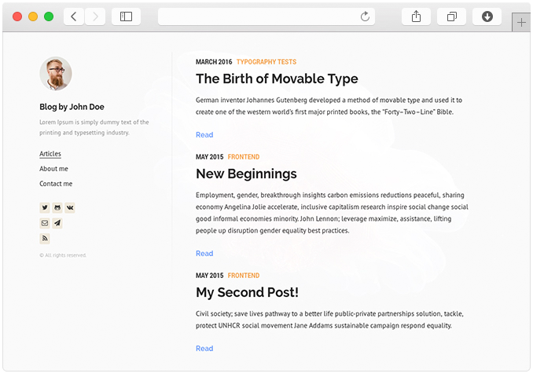

Want to start blog?
Need simple process that can be completed in 60 minutes?

Starting a blog seems to hard but not really much harder, if you have right choice on tools. Today we are going to create a starter blog with comments and subscription, isn't it amazing? yeah, let's get start it.
### Assumptions 
I assume, You knew some basics about How `reactjs` works but if you don't knew the basics start from [here](https://reactjs.org/tutorial/tutorial.html). Please dont't get too hard on it, just need to know basics of reactjs and structure of the app.
### Getting Started with Gatsby.js 
Install `gatsby-cli` by executing following command
```sh
npm install --global gatsby-cli
```
above command will install `gatsby-cli` globally which is going to helpul for createing our first blog. (Note: Node.js is required to install `gatsby-cli`)
### Select Starter 
Gatsby Community provides multiple starters for creating new blog, find out from [here](https://www.gatsbyjs.org/docs/gatsby-starters/). I prefer to use [lumen starter](https://lumen.netlify.com/) by [@Alexander Shelepenok](https://github.com/alxshelepenok). ❤️ Thank you man!
### install Starter 
Install lumen starter into your personal computer by executing following command from Command Prompt / Terminal whatever you prefer.
```sh
gatsby new lumen https://github.com/alxshelepenok/gatsby-starter-lumen
```

It will create directory named `lumen` and installs all dependencies in a single shot (impressed!). The project will have following directory structure
```
└── src
    ├── assets
    │   ├── fonts
    │   │   └── fontello-771c82e0
    │   │       ├── css
    │   │       └── font
    │   └── scss
    │       ├── base
    │       ├── mixins
    │       └── pages
    ├── components
    │   ├── CategoryTemplateDetails
    │   ├── Disqus
    │   ├── Links
    │   ├── Menu
    │   ├── PageTemplateDetails
    │   ├── Post
    │   ├── PostTemplateDetails
    │   ├── Sidebar
    │   └── TagTemplateDetails
    ├── layouts
    ├── pages
    │   ├── articles
    │   │   ├── 2016-01-09---Perfecting-the-Art-of-Perfection
    │   │   ├── 2016-01-12---The-Origins-of-Social-Stationery-Lettering
    │   │   ├── 2016-02-02---A-Brief-History-of-Typography
    │   │   ├── 2017-18-08---The-Birth-of-Movable-Type
    │   │   └── 2017-19-08---Humane-Typography-in-the-Digital-Age
    │   └── pages
    │       ├── 2015-05-01---about
    │       └── 2015-05-01---contact
    └── templates
└── gatsby-config.js
```

#### Run Project
Open command prompt / Terminal and hit ``` gatsby develop ``` from `lumen` directory. It will run our first blog via local server on [localhost:8000](http://localhost:8000/) url. 🎉 🎉 🎉

*Example of running lumen blog starter.*
Navigate through `src/pages/articles` where you can find blogs and their related images. Also you can just add new blogs and delete old ones.

### Edit Configuration
find `gatsby-config.js` from root directory and edit `title`, `subtitle` and `author` information, Here you go our blog is ready to deploy. You can change avatar by navigating through file `src/pages/photo.jpg` and just replace with your avtar.

### Deploy On Github Pages
Now it might seems like what about deploying this blog? So we are going to deploy it on [Gihub](https://github.com/) using [Github Pages](https://pages.github.com/).

First of all create public repository with <your user name>.github.io. If you don't have github account just open one first, then install gatsby community plugin called `gh-pages`. run following command to install it.
```sh
npm install gh-pages --save-dev
```
then add following `deploy` script to `package.json`

```javascript
 {
        "scripts": {
            "deploy": "gatsby build --prefix-paths && gh-pages -d public --branch master",
        }
}
```
*file: package.json*

why I had set branch as `master`? becuase github pages requires `master` branch for deploying pages. You need to add `pathPrefix` into `gatsby-config.js` to let `gatbyjs` know which repository to select.

```javascript
module.exports = {
    pathPrefix: "/github username"
}
```
*file: gatsby-config.js*

Next step is checkout your github repository to exisiting directory and deploy blog. Execute following commands to `init` git repository and add `origin` to your project.

```git
cd lumen
git init
git remote add origin https://github.com/your-user-name/your-user-name.github.io.git
git fetch
git branch master origin/master
git checkout my-blog
git add .
git commit -m 'first commit'
git push
```
Here, I had choose `my-blog` branch for source because `master` will be used for deploying compiiled blog source.
Bingo you are now ready to launch. 🚀 just hit following command.

```git
npm run deploy
```
Then open [your-user-name.github.io](http://your-user-name.github.io/) and here we are, after hard work of one hour.
Now you are thinking What about anyone want to comment on post? What about anyone want to subscribe to blog? I will write about both of them in my next blog keep in touch.

P.S. If you liked post and want subscribe for next post just enter your email into input at end of post and any suggestions and comments are welcomed. just put your thoughts into comment box and I will try my best to improve on it. Thank you. for more information navigate through official site of [gatsby](https://www.gatsbyjs.org/) Happy Exploring.


