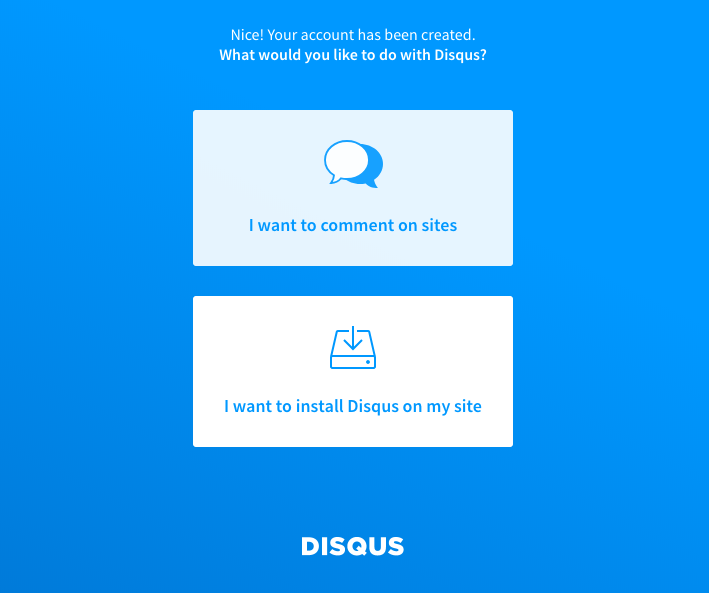
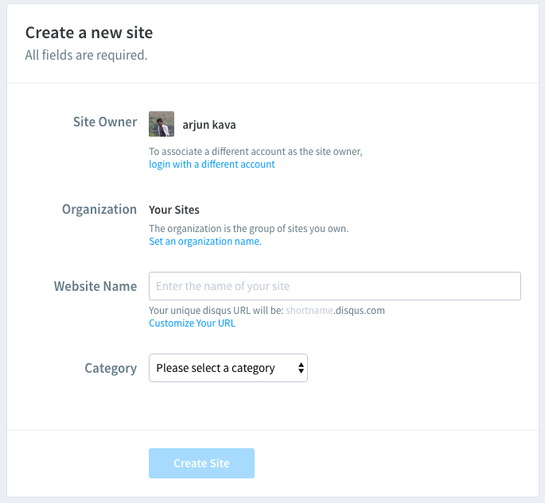

After creating blog, It will be meaningless If nobody comment it with ❤️ ❤️ ❤️ or 😍 😍 😍, So Let some emojis to be flow around. 

If you have not read my first blog, Please ready it first [how-to-create-successfull-blog-in-hour](https://arjun-kava.github.io/posts/how-to-create-successfull-blog-in-hour/). Ignore if you have already read it.

This blog is all about improvements on How to get user feedback through comments, How to engage with them with subscriptions and Analyze traffic.

First of all Hats off to React Community and Gatsby Community. All community memebers are very active and providing variety of plugins for developers. Let's start by adding multiple plugins integration for comments, subscriptions and trafiic analytics.

#### [Add Disqus Plugin For Comments](#add-disqus-plugin-for-comments)
We are going to use one of the plugin for integrating [disqus](https://disqus.com) with `gatsbyjs`. hit the following command from your project root.

```sh
yarn add react-disqus-comments --save
```

Then create directory named `Disqus` under `src/components` directory and create `index.jsx` file also put following component code into `index.jsx` file.

```javascript
import React, { Component } from 'react';
import ReactDisqusComments from 'react-disqus-comments';

class Disqus extends Component {
  constructor(props) {
    super(props);
    this.state = { toasts: [] };
    this.notifyAboutComment = this.notifyAboutComment.bind(this);
    this.onSnackbarDismiss = this.onSnackbarDismiss.bind(this);
  }

  onSnackbarDismiss() {
    const [, ...toasts] = this.state.toasts;
    this.setState({ toasts });
  }
  notifyAboutComment() {
    const toasts = this.state.toasts.slice();
    toasts.push({ text: 'New comment available!!' });
    this.setState({ toasts });
  }
  render() {
    const { postNode, siteMetadata } = this.props;
    if (!siteMetadata.disqusShortname) {
      return null;
    }
    const post = postNode.frontmatter;
    const url = siteMetadata.url + postNode.fields.slug;
    return (
      <ReactDisqusComments
        shortname={siteMetadata.disqusShortname}
        identifier={post.title}
        title={post.title}
        url={url}
        category_id={post.category_id}
        onNewComment={this.notifyAboutComment}
      />
    );
  }
}

export default Disqus;
```

Now open official site of [Disqus](https://disqus.com) and create your account, click on `Get Started` then it will ask two options in which select `I want to Install Disqus On My Site` as displayed in following.

*Start With Disqus.*

After selecting above option, It will ask you to submit details for your website just add name of your site.

*Create Site With Disqus.*

So far we had setup component for Disqus, Use this component and append it at end of `PostTemplateDetails/index.jsx` file. 

 ```sh
 src/components/PostTemplateDetails/index.jsx
 ```

 below I have added three major lines which inport Disqus component, configure component and then call component in `render()` function.

 ```javascript
 ...
import Disqus from '../Disqus';

class PostTemplateDetails extends React.Component {
  render() {
    ...
    const commentsBlock = (
      <div>
        <Disqus postNode={post} siteMetadata={this.props.data.site.siteMetadata} />
      </div>
    );

    return (
      <div>
        {homeBlock}
        <div className="post-single">
            ...
            {commentsBlock}
          </div>
        </div>
      </div>
    );
  }
}

export default PostTemplateDetails;

 ```
*Code of Disqus Plugin Integration*

Next you have to add `short name` of your site under `siteMetadata` in `gaatsby-config.js` file as below.

```javascript
siteMetadata: {
  ...
   disqusShortname: 'your-short-name' // which is website name added while creting Disqus account.
}
```

Thats all done with Disqus, run project and now you can see comment section at the end of each post.

#### [Add Mail Chimp Plugin For Subscription](#add-mailchimp-plugin-for-subscription)
we are going to use 'Mail Chimp' for creting subscription model. Install following plugin to support Mail Chimp Integration with gatsbyjs. If you don't have Mail Chip account open it from [here](https://login.mailchimp.com/signup).

```javascript
yarn add gatsby-plugin-mailchimp --save
```

Now, you need `Mailchimp Endpoint` follow steps given at offcial plugin page [gatsby-plugin-mailchimp](https://www.gatsbyjs.org/packages/gatsby-plugin-mailchimp/?=mail). Configure `Mail Chimp Plugin` be adding following line into `gatsby-config.js`

```javascript
plugins: [
  ...
  {
    resolve: 'gatsby-plugin-mailchimp',
    options: {
      endpoint: 'your mail chip end point url', // see instructions at official plugin page
    },
  },
]
```

I have created small component to call Mail Chimp API for adding user into list of subscription as below. Add this code into `Subscribe/index.jsx` by creating new component under `src/components`
```javascript
import React, { Component } from 'react';
import addToMailchimp from 'gatsby-plugin-mailchimp'

export default class Subscribe extends React.Component {
    constructor() {
        super()
        this.state = {
            email: ``,
        }
    }

    // Update state each time user edits their email address
    _handleEmailChange = e => {
        this.setState({ email: e.target.value })
    }

    // Post to MC server & handle its response
    _postEmailToMailchimp = (email, attributes) => {
        addToMailchimp(email, attributes)
            .then(result => {
                // Mailchimp always returns a 200 response
                // So we check the result for MC errors & failures
                if (result.result !== `success`) {
                    this.setState({
                        status: `error`,
                        msg: result.msg,
                    })
                } else {
                    // Email address succesfully subcribed to Mailchimp
                    this.setState({
                        status: `success`,
                        msg: result.msg,
                    })
                }
            })
            .catch(err => {
                // Network failures, timeouts, etc
                this.setState({
                    status: `error`,
                    msg: err,
                })
            })
    }

    _handleFormSubmit = e => {
        e.preventDefault()
        e.stopPropagation()

        if (!this.state.email) {
            this.setState({
                status: `error`,
                msg: "Please enter valid email!",
            })
        }
        else {

            this.setState(
                {
                    status: `sending`,
                    msg: null,
                }

            )
            // setState callback (subscribe email to MC)
            this._postEmailToMailchimp(this.state.email, {
                pathname: document.location.pathname,
            })
        }
    }


    render() {

        return (
            <div>
                {this.state.status === `success` ? (
                    <div>Thank you! Youʼll receive your first email shortly.</div>
                ) : (
                        <div >
                            <span>Enjoyed this post? Want to Receive the next one in your inbox!</span>
                            <form
                                id="email-capture"
                                method="post"
                                noValidate
                            >
                                <div>
                                    <input
                                        placeholder="you@email.com"
                                        onChange={this._handleEmailChange}
                                        required
                                    />
                                    <button
                                        className="icon-mail"
                                        type="submit"
                                        onClick={this._handleFormSubmit}
                                    >

                                    </button>
                                    {this.state.status === `error` && (
                                        <div
                                            dangerouslySetInnerHTML={{ __html: this.state.msg }}
                                        />
                                    )}
                                </div>
                            </form>
                        </div>
                    )}
            </div>
        )
    }
}
```

The above configuration is for creating and integrating `Subscribe Plugin` while we need to call this component to display subscription form. For this purpose we are going to use `src/PostTemplateDetails/index.jsx` component add subscribe block above `{CommentBlock}` added earlier in this post as below.

```javascript
...
import Subscribe from '../Subscribe';

class PostTemplateDetails extends React.Component {
  render() {
    ...
    const SubscribeBlock = (
      <div>
        <Subscribe />
      </div>
    );

    return (
      <div>
        {homeBlock}
        <div className="post-single">
            ...
            {SubscribeBlock}
            {CommentBlock}
          </div>
        </div>
      </div>
    );
  }
}

export default PostTemplateDetails;
```

Run the project and Now You can see subscription block at end of each post and Test it by adding new Email into it. Which will be reflect to your `Mail Chimp List` created earlier. Amazing!

#### [Add Google Analytics Plugin For Tracking Trafic](#add-mailchimp-plugin-for-subscription)
So far we had added Feedback to our blog but It is more important to see How many users have reached to blog and from where traffic flows. I am going to introduce third plugin by `gatsbyjs` community called [gatsby-plugin-google-analytics](https://www.gatsbyjs.org/packages/gatsby-plugin-google-analytics/?=gatsby-plugin-google-analytics). You should have to sign up through [Google Analytics](https://www.google.com/analytics/#?modal_active=none) and get tracking id from Analytics by creating New Website Account. Easy!

Install plugin into project by executing fllowing command.

```sh
yarn add gatsby-plugin-google-analytics --save
```

and then add following configuration to your `gatsby-config.js` file. Here you have to replace `UA-YOUR-TRACKING-ID` to tracking id of your google analytics account.

```javascript
plugins: [
  ...
    {
      resolve: 'gatsby-plugin-google-analytics',
      options: { trackingId: 'UA-YOUR-TRACKING-ID' }
    }
]
```

Today, we had done so many things to make our blog more robust, dynamic and also user friendly. After completion of these steps, We are now ready to hit deployment So why we are wasting more time? just hit following command and see these changes in your live blog.

```sh
run npm deploy
```

P.S. You can get reference of all these code on my blog repository [arjun-kava.github.io](https://github.com/arjun-kava/arjun-kava.github.io) under `gatsby` branch. If you like post and want next in your inbox hit subscription button with your email. Also give your opinion about post in below comment box. Happy Exploring.

As a deep learning engineer from today onwards I am going to write more about my learning journey of Computer Vision, Deep Learning and related libraries. Stay In Touch.
