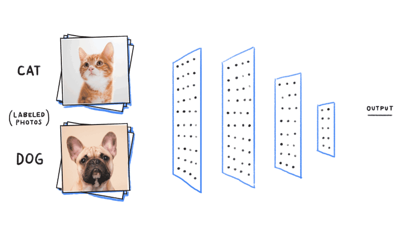
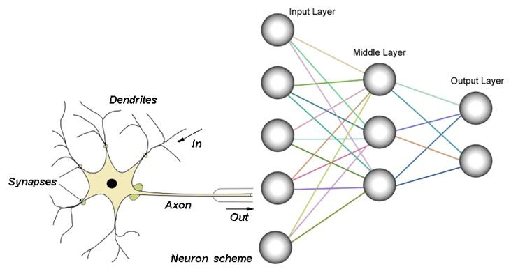

In last couple decades *Artificial Intelligence* had made a great progress to solve day to day problems. We even didn't knew how much AI used in our daily life. It is just everywhere finding a product from Amazon, searching something on Google even tagging your buddy on Facebook.

But what kind of work, *Scientists* are doing over the last couple of decades and many of them trying to replicate *Human Brain*! How? With the help of deep learnings and neural network which behaves like human brain. How exactly Deep Learning and Neural Network works? Lets take a closer look.

---
### Road Map

Have you ever think How robot recognize Cat or Dog standing in front of it? No! It's time to find it out otherwise Robot will take our job to make pets happier then ever soon.

Image Source: [becominghuman.ai](https://becominghuman.ai/building-an-image-classifier-using-deep-learning-in-python-totally-from-a-beginners-perspective-be8dbaf22dd8)

In Today's post we will learn, How science of *Deep Learning* have made it possible to recognize day to day life entities and How it simulates procedure followed by Human Brain. isn't it exiting? No! Let me make it one.

### How Does our 1,400 grams head differs from Deep Learning?

Human brain has billions of cells called *Neurons*. Each neuron is made of *Cell Body*(i.e. Central Unit), *Dendrites*(i.e. Cell's Input) and *Axo*n(i.e. Cell's Output). 

At each neuron, It receives signal from other neurons. If the incoming signal have high electrical pulse for a certain period of time, It send high electrical pulse into terminals and These Terminals connected to other Dendrites of neurons in network.

As we learn new things these neurons increases. Every action done by human and also though generated by our brain is somehow dependent on series of *Neuron Activations*.

Image Source: [msatechnosoft.in](https://msatechnosoft.in/blog/tech-blogs/artificial-neural-network-types-feed-forward-feedback-structure-perceptron-machine-learning-applications)

While on other hand, *ANN(Artificial Neural Network)* is simulation of same concept. ANN have *Input Layers(i.e. Dendrites)*, *Middle Hidden Layers(i.e. Cell Body)* and *Output Layes(i.e. Axon)*. Information are feed into the network via Input Layer, Which *triggers some hidden units* which flows from left to right. Inputs are *multiplied the weights* travels along. Every Hidden layer add some value. If Sum is more than a certain *threshold* value, the Hidden Node fires and *triggers next connected node of network*.

For the neural network to learn, *continuous feedback* needs to be involved. As children learn by being told what is right or wrong, Neural Network learn things exactly the same way by feedback process called *Backpropogation*(will talk about it more in next posts). This procedure involves comparison of the output produce and output meant to be be produce.

*The Learning Process* of Neural Network is defines each and every feature of particular object and set weights of network on basis of actual and intended output

### Foot Notes

There are lots of amazing application of Neural Network such as Image Classification, Regression, Segmentation, Generation and lots more. We are living in era where things are automating as we moves forward to the future.

Image Source: [hackernoon.com](https://hackernoon.com/learning-ai-if-you-suck-at-math-p5-deep-learning-and-convolutional-neural-nets-in-plain-english-cda79679bbe3)

P.S. : I will post more about implementations, libraries and framework used for Deep Learning soon, meanwhile if you have any queries regarding this post or deep learning free to comment below and also to DM me. 

