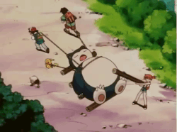
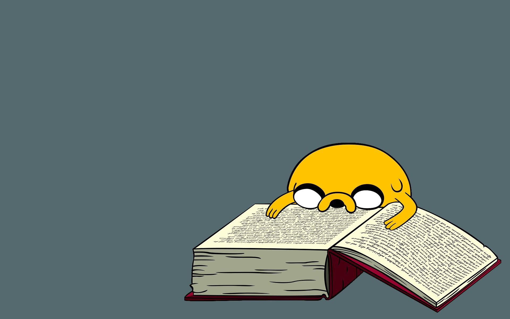
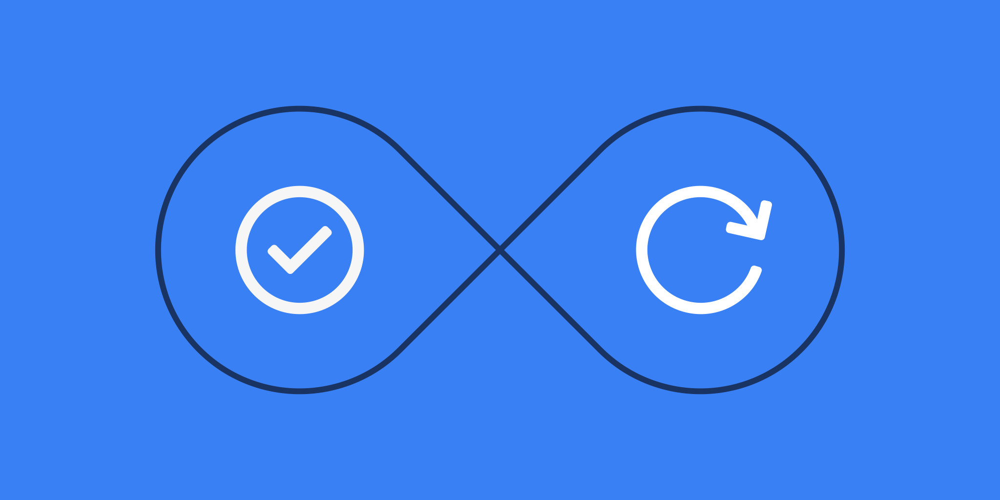

> “Perhaps when we find ourselves wanting everything, it is because we are dangerously close to wanting nothing.” ― Sylvia Plath

Today's article is all about managing yourself and follows that `long-term goal` sheet flows through our mind every day but still needs to move from `paper to production`.

### Roadmap 
Sometimes we are too much worried about work, family, and relations while we forgot to explore our self. I have been working on my productivity during the last six months and I found a concept that made me more `productive` than ever.

Before these six months, I was the `dump`. I even didn't know the basic criteria of time management and productivity, So How The Beast inside me is more active now? Let's take a closer look at my experience. 

#### The article is divided into the following major parts:
1. Rule of Productivity
2. Writing
3. Working
4. Reading
5. Repeat

----

## The Golden Rule Of Productivity 
There is a simple rule of productivity but, Do you know most of the people struggles to implement simple rules! Why? because They are so simple.

#### The Golden Rule
1. Write(20), Work(60), Read(20).
2. Repeat Rule Number 1 Every day.

Let me explain above rules in much more deeper meaning. The Earth requires 24 hours to do a spin that's why we have `24 hours` in a normal day. The whole day has a `16:8 hour` ratio means `16 hours without sleep` and `8 with sleep`(worst case). 

I am more interested in these 16 hours where if we minus 2 hours from it for getting shower, breakfast, lunch, dinner still we have 14 hours to manage daily work life. Now I am focusing on that **Golden 14 Hours**. 

Higher Productivity is dependent upon two major factors 
1. Time 
2. Energy

We have that golden 14 hours so, I am not more concerned about `Time` but `Energy` might worry me more than anything. That's why Rule Number 1 is more generous for our perspective. 

I have prioritized every word with weights. From left to right energy as per levels go down, meaning We need more energy for writing, lesser than it for day to day job and much less for reading. On this note I had scheduled my golden 14 hours into 2.8:8.4:2.8 hours ratio for Writing, Working and Reading respectively, Bingo I am done with energy also.

---

## Writing 
Writing has more energy consumption than the other two(I am taking mental energy as a unit). Here, Writing doesn't mean a job as a writer but writing for yourself.

Image Source: [guoguiyan](http://www.guoguiyan.com/writing-wallpapers.html)

In other words, sharing your knowledge with the community and of course people around you. It can be anything writing a Journal, Blog, Answer some questions on Quora or Reddit, Help people to resolve their Bugs on Github etc. 

It does make you more proactive and gives you much deeper understanding of the topic written. For me, It is a new passion while exploring new learnings and also my resolution for this year.

I woke up early 5:30 AM in the morning to just write these stuff. I put 15 min timers for two and half hours to be more productive on my writings and paying more attention to write rather than being disturbed by other stuff.

---

## Working
Most amazing part of life is `working for a dream`. With the highest rank in a list also more responsibility lies here. I am very serious about spending these hours. 

First of all, I wrote tasks for a day and `prioritize` on basis of importance and of course how much time and energy requires for each. I prefer to use [Trello](https://trello.com/) which saves most of my time.

Image Source: [wallpaperwire](https://wallpaperwire.com/funny-working-man-nice-wallpaper/)

Then I decide exact durations for each task but some of them are repetitive for each day with fix bound durations. I set `hour-to-hour timers` for reminding me to pay more attention to task rather than being disturbed by Notification, Mail or anything. After completing a single task I check messages, emails and then moves to the next one.

As my energy levels go down less task remains on my hand. At the end of the day I `review today's work` and find out anything missing at the moment.

---

## Reading
> “A reader lives a thousand lives before he dies, said Jojen. The man who never reads lives only one.” ― George R.R. Martin, A Dance with Dragons

I have a great passion for reading and also written a huge list of `a wish to read books`. Back to the topic, Here reading means reading books, give time to learn new things, watch a course on [Coursera](https://www.coursera.org/) more generous learning something.

Image Source: [tkpurwo](http://tkpurwo.com/reading-desktop-wallpaper/reading-desktop-wallpaper-inspirational-funny-image-free-hd-wallpapers-page-0/)

After the struggle of six months, I found precisely that reading has the most spectacular effect on my productivity, mindset, and everything I thought. After reading these books I have profound my maturity on another level which helped me to take the hardest decisions of my life.

I generally prefer to read books on a topic where I struggled more such as `Rich Dad Poor Dad`(the struggle of saving money), `Zero to One`(the struggle of starting startup), `How to Influence People`(the struggle for selling something).

I also read with my friend named `"Little Yellow Marker"` for marking lines which strike most to my head. This method is very helpful because while reading the chapter second time I just have to look at major marked portions and My mind flows with everything I had read.

---

## Repeating
Generally, I am working at the office in weekends which gave me another one and a half day to focus on writing, reading and of course, planning more stuff as well as review the whole week activities.

Nowadays I focus on review my self on a weekly basis which helped me a lot to `correct my past mistakes` in a future work.

Image Source: [nozbe](https://nozbe.com/blog/repeating_tasks/)

I change the above ratio sometimes due to `the hard deadline` and some more important stuff but I think maintaining average is the best part of my journey.

---

## Foot Notes
I am still learning about productivity and going to change my schedule as per my need. If you feel I have to change my schedule which can make me more productive. Please comment below your thoughts about it.

I am managing [Trello](https://trello.com/) boards for Writing, Reading, Tasking, New Year Resolution, for Everything I want to plan. I will write "How to plan those boards" in next articles. till then Happy Exploring.

