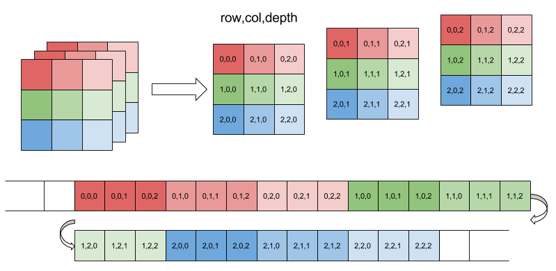
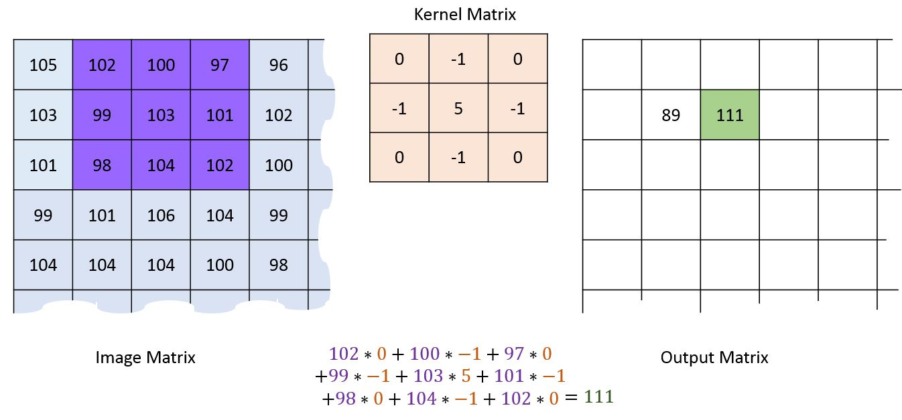

> “Life is really simple, but we insist on making it complicated.” ― Confucius

When I had started to learn about **Machine Learning**, **Deep Learning**, and **Neural Networks**, It was like finding a beam of light in a complete dark hole but you know the science of the black hole. It is a region in space in which the singularity’s gravitational force is so strong that not even light can escape its pull.

So I was in completely wrong directions rather than finding light, I need to look at *Singularity’s Gravitational*. Then I decided to get into fundamentals rather than getting into *Math* first.

Image Source: [knowyourmeme](https://knowyourmeme.com/memes/we-need-to-go-deeper)

Today's article is all about going deeper into the fancy word called "*Convolutional Neural Network*" and here is our roadmap.

1. How did computer see an image?
2. Convolutional Neural Network (CNN)
3. Understanding at Deeper Level

---

### How did computer see an image?

The Image is nothing but *Three-dimensional array* which contains pixel values varied from 0 to 255 as shown below where **rows equal to the width**, **cols equal to height** and **depth is intensity such as RGB, HSV etc**. as shown in Figure 1.

Figure 1(Image Source: [thegreenplace](https://eli.thegreenplace.net/2015/memory-layout-of-multi-dimensional-arrays))

So for our CPU / GPU, It is a bunch of integers which reflects the intensity of color which means at the end of the day everything is just a reflection of light.

---

### Convolutional Neural Network (CNN)

In machine learning, *a convolutional neural network (CNN, or ConvNet)* is a class of deep, feed-forward artificial neural networks, most commonly applied to analyzing visual imagery. - *Wikipedia*

I think the above definition is perfect but more complex to digest, so here is the much simpler. CNN is very similar to Neural Network but it takes images as input and allows us to encode certain properties into the architecture. (if you don't know the neural network, please read this article [Prove Simplification of Artificial Neural Network](https://arjun-kava.github.io/posts/prove-simplification-of-neural-network/))

In more general words, CNN extracts features from the image and store it as weights which are used to predict the purpose of the image stands for. 

Technically, It is a structured stack of Neural Network Layers responsible for extracting the feature from an image and which network has seen to predict possibilities of the unseen image.

Figure 2(Image Source: [mathworks](https://www.mathworks.com/content/mathworks/www/en/solutions/deep-learning/convolutional-neural-network/jcr:content/mainParsys/band_copy_copy_14735_1026954091/mainParsys/columns_1606542234_c/2/image.adapt.full.high.jpg/1530247928116.jpg))

Take a look at Figure 2 which exactly describes the working methodology of *CNN* extraction of a feature from the image of a car. Some of the words in the above image are complex to understand but, at the end of this article everything will be more meaningful

### Understanding at Deeper Level

CNN is made up of layers. Each layer transforms one volume of activations to another through a differentiable function. CNN use mainly three type of layers which are responsible to extract deeper features from a particular class of image: **Convolutional Layer**, **Pooling Layer**, and **Fully-Connected Layer**

Let's take a closer look at functionalities of each layer:

#### The Convolutional Layer

As we had seen above that an image is a matrix of a pixel. The convolutional layer operates these pixels.

The convolutional layer does multiple **Convolutional Operations** on multiple channels of image i.e. depth. Each convolution operation has a kernel which could be matrix smaller than height and width of the original image. Each kernel have their specific tasks such as **sharpening**, **blurring**, **edge detection**, and many more

Take a look at Figure 3, where each channel of the original image is applied to some kernels to generate another matrix which reduces the parameters of image and extracts features from it. 

Figure 3(Image Source: [machinelearninguru](http://machinelearninguru.com/computer_vision/basics/convolution/convolution_layer.html))

The following kernel sharpens the image by multiplying each element of the kernel with its the corresponding element of the image matrix.

$$
kernel = \begin{bmatrix}
   0 & -1 & 0 \\
   -1 & 5 & -1 \\
   0 & -1 & 0 
\end{bmatrix}
$$

Figure 4(Image Source: [machinelearninguru](http://machinelearninguru.com/_images/topics/computer_vision/basics/convolution/3.JPG))

As shown in  Figure 4, **A sliding window** with same width and height multiplied with kernel and place multiplication on the same corresponding element of an original image. 

The Output of filter can be easily visualized from the Figure 5 by comparing **left(the original image)** and **right(the shapen image)**.

Figure 5(Image Source: [fotokto](http://fotokto.ru/blogs/3-krutih-sposoba-ispolzovat-filtr-v-fotoshope-pod-nazvaniem-cvetovoi-kontrast-high-pass-23193.html))

Now the problem arises that, These kernel operations cleared border row values from the original matrix which can result into loss of data To overcome this a problem of **padding parameter** introduced with **stride parameter**.

The padding parameter adds another border rows and columns to the actual matrix initialized as zero which made possible to fill empty border rows and columns and doesn't add any disturbance to the actual image also. The stride parameter means the intensity of a sliding window for multiplication such as 2 pixels i.e. two column and two-row movement each time. As shown in Figure 6

Figure 6(Image Source: [machinelearninguru](http://machinelearninguru.com/_images/topics/computer_vision/basics/convolution/6.JPG))

Generally, we use multiple stacks of filters to minimize the number of output called **"Activation Map"**.

For example, we have an input image of size $$32*32*3$$. And we apply 10 filters of size $$5*5*3$$ with valid padding. The output would have the dimensions as $$28*28*10$$. (Figure 7)

Figure 7(Image Source: [analyticsvidhya](https://www.analyticsvidhya.com/blog/2017/06/architecture-of-convolutional-neural-networks-simplified-demystified/))

The output of multiple convolution filters stack might be something like below (Figure 8) which can not be understood through human eyes!

Figure 8(Image Source:[jhui.github.io](https://jhui.github.io/2017/03/16/CNN-Convolutional-neural-network/))

Each Convolution generally followed by **Activation Function** which ensures some positive energy into the network by maintaining the weight of each neuron with specified bias. Technically, Activation function decides whether neuron should fire or not based on the sum of the weights. Example of Activation function are Relu, Sigmoid etc.(for more info. read [prove-simplification-of-neural-network](https://arjun-kava.github.io/posts/prove-simplification-of-neural-network/))

#### The Pooling Layer

The **Pooling Layer** is responsible for reducing the _spatial size of the image_ which is independent of each depth dimension i.e. The _depth_ of the image remains unchanged.

As shown in the below figure, **The Max pooling** is used on $$224*224*64$$ dimensional image to convert it into $$112*112*64$$ dimensions where the _depth remained unchanged_, Here we have take stride as 2 and pooling size also as 2(Figure 9).

Figure 9(Image Source: [leonardoaraujosantos](https://leonardoaraujosantos.gitbooks.io/artificial-inteligence/content/pooling_layer.html))

The output of pooling might same as shown in below Figure 10 from _the right to the left_ .

Figure 10(Image Source: [tomaszgolan](http://tomaszgolan.github.io/reveal_talks/html/mlmpr_warsaw17.html))

### The Output Layer / The Fully-Connected Layer

At the end of **Multiple Convolution + Activation and padding**, It came to possible output in the form of entities or a class. The convolution and the pooling layers are only responsible to extract features and reduce the number of parameters of an original image. However, the Final output is generated by The Fully Connected Layer which is equal to the number of classes in some case or number of possibilities in another case.

The convolution layers complete the forward pass but, The output layer has a loss function which is responsible to backpropagate and updates weights as well as biases for error and loss reduction.

At the end of output possibilities, CNN applies logistic regression which is responsible to assign probabilities to each class in either binary or multiclass problem such as *Softmax*

Figure 11 describes the whole procedure in one shot through the classification problem. The red portion called "**Feature Extraction**" is our Convolutional + Pooling layers responsible for extracting parameter by downsampling the network and The purple portion called "**Classification**" which is the fully connected layer with logistic regression responsible for predicting label.

Figure 11(Image Source: [developer.nvidia.com](https://developer.nvidia.com/discover/convolutional-neural-network))
### Foot Notes

I hope you got the idea behind the Convolution Neural Networks without getting into complex mathematics. Further, in next articles, I will discuss implementation details of neural network till then stay tuned.

### References
1. [cs231n.github.io](http://cs231n.github.io/convolutional-networks/)

2. [machinelearninguru.com](http://machinelearninguru.com/computer_vision/basics/convolution/convolution_layer.html)

3. [www.analyticsvidhya.com](https://www.analyticsvidhya.com/blog/2017/06/architecture-of-convolutional-neural-networks-simplified-demystified/)
