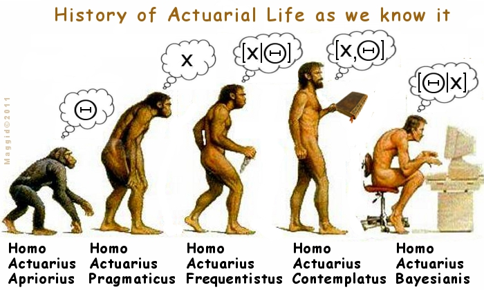
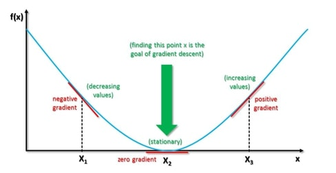

>“I like solitude. It is when you truly hear and speak your natural, unadulterated mind, and outcomes your most stupid self as well as your most intelligent self. It is when you realize who you are and the extents of the good and the evils which you are capable of.” 
― Criss Jami, Killosophy

The Human's are evolved about *2.3 to 2.4 million years* ago. Since the 18th century, Scientists thought the great apes to be closely related to human beings. In the 19th century, They speculated that closest living relatives of humans were either *chimpanzees* or *gorillas*.

Do you know what made us different from our closest living relatives?
Our way of the **thinking!**


Image source: [lazarzivadinovic.blogspot.com](https://lazarzivadinovic.blogspot.com/2016/05/parametri-spektroskopski-dvojnog-sistema.html)

---

Humans have a persistent process of thinking. When we read something, we understand each and every word based on our understanding of previous words also the emotions exert an effect on human thinking by producing actions such as crying, laughing and sadness. 

Now the question arises, what made machines to think same as Human Being. Nowadays application such as *artificial assistance* has been understanding each and every perspective of human words.

---

Today's article is all about understanding, How Artificial Intelligence understands the meaning of everything we spoke. The roadmap is divided into the following major parts.
1. *Feed-Forward Neural Network*
2. *Recurrent Neural Network (RNN)*
3. *Falling of Recurrent Neural Network*
3. *Long-Short Term Memory (LSTM)*
4. *Simple Implementation of LSTM*

If you haven't discovered about, How Neural Network operates then, I highly counseled reading the following articles first:
1. *[Prove Simplification of Artificial Neural Network - by Arjun Kava](https://arjun-kava.github.io/posts/prove-simplification-of-neural-network/)*
2. *[That's not enough, We have to go deeper - by Arjun Kava](https://arjun-kava.github.io/posts/thats-not-enough-we-have-to-go-deeper/)*

Otherwise, Let's start exploring.

___

### Feed-Forward Neural Network
The Feed-Forward Neural Network are flowing in a signal optimistic direction from Input layers then though Hidden layers to Output Layers as shown in *Fig 1: Feed Forward Network*.

As shown clearly, Feed-Forward Neural Network could not persist any memory into the network due to simple straightforward architecture. Such kind of architecture is not suitable for natural language processing which is overcome by Recurrent Neural Network (RNN).


*Fig 1: Feed Forward Network (Source: [en.wikipedia.org](https://en.wikipedia.org/wiki/Feedforward_neural_network#/media/File:Feed_forward_neural_net.gif))*

___

### Recurrent Neural Network (RNN)

Recurrent Neural Networks were developed in the 1980s. Hopfield networks were discovered by John Hopfield in 1982. Traditionally, Feedforward Neural Network is used to understand the meaning of words but those have not persistence property.

Suppose, You knew that we are relatives of either *chimpanzees* or *gorillas* because of our mind have persistent memory. Traditional networks could not use persist of previous memories to inform later ones.

A Feed-Forward Neural Network is constrained to accept a fixed-size vector as input and produce fixed-sized vector as output with a fixed amount of computations steps.

On the other hand, RNNs are a network of neuron-like nodes organized into successive *layers*, each node in a given layer with a directed(one-way) connection to every other node in next successive layer. Each node has time-varying real-valued activation(tanh activation). Each connection modifies real-valued weights. Nodes are either input nodes, output nodes or hidden nodes.

In simple words, *RNN network* have the ability of cycling information through the loop. The decision of the network depends on current input as well as what learned before using short-term memory.


*Fig 3: Recurrent Neural Network (Source: [en.wikipedia.org](https://en.wikipedia.org/wiki/File:Recurrent_neural_network_unfold.svg))*

A typical on Node looks like shown in *Fig 3: Recurrent Neural Network(Left)*, where *"X"* is input and *"O"* is output. A loop enables learning to be passed from one step of the network to the next. A recurrent neural network can be considered as the chain of multiple copies of the same network, each passing some information to a successor.

As shown in Fig 3(right portion), This represents unrolling after equal sign which accurately describes the passing of sequences for different time steps. The error back-propagates through the first to the last timestep while unrolling all the timesteps. This allows modernizing weights at each timestep of the resultant error of each timestep.

---

### Falling of Recurrent Neural Network

Despite, the fact that RNNs are widely used for sequential data analysis but It seems that they have certain limitations such as consider predicting the last word in the following sentence.

"A helium nucleus has two protons, whereas hydrogen has only **one**."

The forward information suggests next term will be in numbers but, Due to the looping structure of RNN, The information cycles frequently which result in a mass update of weights. 

This problem specifically classified into two major theories such as *Exploding Gradients* and *Vanishing Gradients*. Both enigmas are related to the gradient which is responsible for propagating an optimal solution to get the intended output.


*Fig 4: Exploding Gradients(increasing values) and Vanising Grandients(decreasing values). (Source: [srdas.github.io/](http://srdas.github.io/DLBook/DL_images/TNN1.png)))*

#### Exploding Gradients
Exploding gradients are an enigma where large error gradients expand and result in very large updates to neural network model weights during training.

This has the effect of your model is unstable and unable to learn from your training data.

#### Vanishing Gradients
Due to the Back-propagation, moving backward and determining gradients of loss with respect to weights. The gradient tends to set smaller and smaller as keep moving backward through the network.

Because of the lower gradient, Network holds learning or needs too much time to learn. This problem was investigated in depth by Hochreiter (1991) and Bengio, et al (1994).

### Long-Short Term Memory (LSTM)

The Long Short-Term Memory(LSTM) was proposed in 1997 by Sepp Hochreiter and Jürgen Schmidhuber and improved in 2000 by Felix Gers' team. The LSTM is the evolution of RNN which is capable of learning long-term dependencies. LSTM is normally augmented by recurrent gates.


*Fig 5: Long Short-Term Memory(Source: [en.wikipedia.org](https://en.wikipedia.org/wiki/File:Long_Short-Term_Memory.svg#/media/File:Long_Short-Term_Memory.svg))*

LSTM prevents backpropagate errors from vanishing and exploding. Instead, errors can flow backward through unlimited numbers of virtual layers unfolded in space. LSTM can learn tasks that require memories of events that happened thousands or even millions of discrete time steps earlier.

A common LSTM network is composed of *a cell*, *an input gate*, *an output gate* and *a forget gate*. The cell remembers values over arbitrary time intervals and three regulates the flow of information into and out of the cell.

An LSTM cell takes an input and stores it for some period of time. This is equivalent to applying the identity function ( $${\displaystyle f(x)=x)}$$ to the input. Because the derivative of the identity function is constant, when an LSTM network is trained with backpropagation through time, the gradient does not vanish.

The activation function of the LSTM gates is often the logistic function. Intuitively, the input gate controls the extent to which a new value flows into the cell, the forget gate controls the extent to which a value remains in the cell and the output gate controls the extent to which the value in the cell is used to compute the output activation of the LSTM unit.

There are connections into and out of the LSTM gates, a few of which are recurrent. The weights of these connections, which need to be learned during training, determine how the gates operate. Check *Fig 6: Peephole Long-Short Term Memory* for illustration of each gate.


*Fig 6: Peephole Long-Short Term Memory (Source: [en.wikipedia.org](https://en.wikipedia.org/wiki/File:Long_Short-Term_Memory.svg#/media/File:Long_Short-Term_Memory.svg))*

### Simple Implementation of LSTM

Here is a simple example which classifies polarity of the sentence using IMDB polarity dataset. Keras includes inbuild dataset of IMDB polarity. 

`gist:arjun-kava/4e08c8c1056785d9b0d7581d724dc08f#lstm_imdb.py`

### Output


```sh
Using TensorFlow backend.
Loading data...
Downloading data from https://s3.amazonaws.com/text-datasets/imdb.npz
17465344/17464789 [==============================] - 62s 4us/step
25000 train sequences
25000 test sequences
Pad sequences (samples x time)
x_train shape: (25000, 80)
x_test shape: (25000, 80)
Build model...
Train...
Train on 25000 samples, validate on 25000 samples
Epoch 1/3
25000/25000 [==============================] - 615s 25ms/step - loss: 0.3808 - acc: 0.8203
Epoch 2/3
25000/25000 [==============================] - 623s 25ms/step - loss: 0.1679 - acc: 0.9366
Epoch 3/3
25000/25000 [==============================] - 562s 22ms/step - loss: 0.0600 - acc: 0.9794
Accuracy: 82.56%
Downloading data from https://s3.amazonaws.com/text-datasets/imdb_word_index.json
1646592/1641221 [==============================] - 6s 3us/step
Great movie I had ever watched.. Sentiment: [[0.9146]]
you know even better than them that you have potential! Stop portraying in parody movies!. Sentiment: [[0.03823381]]
```
As shown above, The output nearest to zero is a negative review and nearest to one is positive. That's all for today.

### Foot Notes
Today I had explained the major concepts used in recent Natural Langauge Processing, Hope you like it. For any queries comment into below box. I will write about more examples in the next articles till then Happy Exploring.