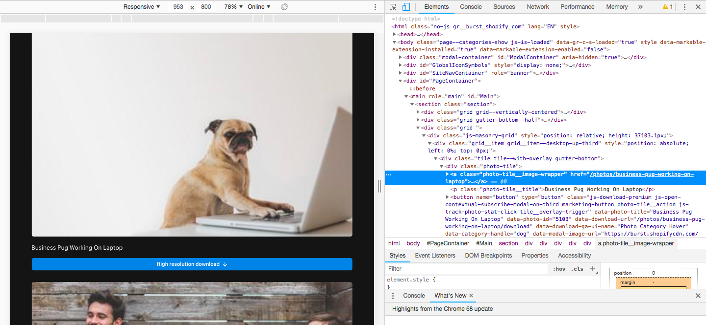

> Do you just tired of doing manual stuff? Does your friends are watching some sci-fi movies and are you stuck with downloading images for your next project? 
> If everything above asked has a positive direction. You are at the right place!


---
> If you just want to explore code, follow git repo
> [web-scrapper-python](https://github.com/zujoio/web-scrapper-python)
> otherwise, go ahead!
---

*The Deep Learning* has become the most promising method for solving *real-world problems*. It is the most revolutionized innovation for *machine learning problems*.

The *Deep Learning Algorithms* have been working so well needs lots of data. The large-scale annotated datasets have been explored for the same purpose. The more annotated data we have, the better our model performs.

----


But well gathering well-annotated data can be time-consuming to acquire as well as expensive. The process can be automated compared to a traditional manual method using web-scrapping.

Today's article is all about web-scrapping using Python.

----

## HTML Introduction
I am assuming you know basic HTML tags but If my assumption is False then follow the link [HTML Tutorial](https://html.com/). 

Anyways, You have been realized that HTML tags have attributes such as `class` and `id` which can be very useful to locate unstructured data of the website.

The same HTML properties and tags will be used to gather information about structure of data while scrapping.

---

## Advice
Few pieces of advice before starting:
1. Respect the Terms of Service (ToS) for commercial purpose.
2. Don't republish your scraped data or any derivative dataset without verifying the license of the data, or without obtaining a written permission from the copyright holder.
3. Don't base your whole business on data scraping. The website(s) that you scrape may eventually block you.

for more information, I recommended reading the great article [Web Scraping and Crawling Are Perfectly Legal, Right?](https://benbernardblog.com/web-scraping-and-crawling-are-perfectly-legal-right/) by [Ben Bernard](https://benbernardblog.com/about-me/)

---

I am going to explain web scrapping implementation step by step in following sections, also the roadmap is list down as below:
1. Getting Started
2. Web Inspector
3. Getting Start with Code
4. Advanced Usage with Selenium Web Driver
5. Advanced Usage with Threading
6. Advanced Usage with Scrapy
7. References

Excited? Let's start step by step.

---

## Getting Started
We are going to use powerful and simple Python as our scrapping language. 

- For installing Python, download compatible version of Python from [https://www.python.org/downloads/](https://www.python.org/downloads/)

further, we need to install [`BeautifulSoup`](https://www.crummy.com/software/BeautifulSoup/bs4/doc/) and [`cssutils`](https://pypi.org/project/cssutils/) using `pip`, a package management tool for Python.

```
pip install BeautifulSoup
pip install cssutils
```

If you are failed to execute commands add `--user` at end of each or try with `sudo`

---

## Web Inspector
Web Inspector is a tool which is going to help us to find HTML behind the scene of any particular website.

Let's take the example of  [burst.shopify.com](burst.shopify.com) page. Open page and select category Dog then right-click on the image. It will open your browser's inspector to inspect a webpage. As shown below:



*- Web Inspector Example*


It is going to display the source of code which might have a structure such as follow:
```
<div class="tile tile--with-overlay gutter-bottom">
    <div class="photo-tile">
        <a class="photo-tile__image-wrapper">
            
```
The HTML tags are uniquely identified by properties of tags. As a result, now, We know the location of uniquely identified data during the process of scrapping.

---

## Getting Start with Code
The Following is configuration need to be placed into `config.py` file. This global configuration is going to be used in different scripts.

```
# Target dataset path
DATASET_PATH = "./dataset"

# Fake user agent for avoiding 503 error
HEADERS = {
    'User-Agent': 'Mozilla/5.0 (X11; Linux x86_64) AppleWebKit/537.36 (KHTML, like Gecko) Chrome/42.0.2311.90 Safari/537.36'
}

# Base url of scrapping
BASE_URL = "https://burst.shopify.com"

# Advanced parameters
# Categories want to scrap
CATEGORIES = ["dog","cat"]

# Page limit to search images from URL
PAGE_FROM =1
PAGE_TO = 2

# Number of workers for downloading pages and images for better and faster performance
WORKERS = 4
```

Now, Let's get our hand dirty with code. import some libraries to getting started with actual code:

```
from bs4 import BeautifulSoup
import os
import urllib.request
from tqdm import tqdm
import ssl
```
`BeautifulSoup` is used for scraping web pages and images while `urllib` is imported to download web pages and images. `tqdm` is used for just displaying progress and `ssl` used for creating fake verification of request.

also, we need to import `config.py` file to use global configuration.

```
from config import *
```

Before starting I am putting some local configuration which is going to used as below.
```
timeout = 60 # Request timeout
url = BASE_URL + "/dog" # URL being scrapped
target_dir = os.path.join(DATASET_PATH,"dog") # Target directory for scrapping data
```

To download source of the page, I have used `urllib` library where `context` specifies a fake SSL certificate to avoid SSL Exceptions and `HEADERS` are imported from global configuration to avoid 503 Exception generated by the web servers.
```
# Bypass SSL verification
context = ssl._create_unverified_context()

# Read HTML page and save as long string
req = urllib.request.Request(url, headers=HEADERS)
response = urllib.request.urlopen(req, timeout=timeout, context=context)

# Read page source
html = response.read()
```

The downloaded HTML source code needs to be parsed to access properties of HTML tags. `BeautifulSoup` is going to use for the same context. It has well-optimized classes and methods to access HTML tags by their unique properties.
```
# Parse HTML source using BeautifulSoup
soup =  BeautifulSoup(html, "html.parser")
```

Now we have a handler called `soup` which is the parsed version of HTML source code that can be attached to any supported method of `BeautifulSoup` class.

As we had learned earlier about unique tags of data. `soup` has a `select()` method which is going to help us to find specific tags from parsed HTML content. Since we have unique class of `` tag.

Below piece of code is will fetch all `` tags from a page whose class defined as `js-track-photo-stat-view`. 

```
image_grids = soup.select('.js-track-photo-stat-view')
```

Next, we have to extract URL of images which can be helpful to download the image.

`image_grids` includes multiple entries of `` as shown listed below. As you can see, `` tag has property named `data-srcset` which includes URLs of images as per resolution 1x, 2x and so on.
```

```

We can access properties of `` tag using `get()` method. Below code going to fetch the content of `data-srcset` property as well as preprocess data to find the highest resolution image from it.

```
image_urls = []
for image_tag in tqdm(image_grids,desc="Find Images"):

    # Fetch data tag which includes sequence of URLS
    image_url = image_tag.get('data-srcset')

    # Extract highest resolution image from data tad
    image_url = image_url.split(',')
    high_resolution_pair = image_url[-1].split(' ')
    high_resolution_image_url = high_resolution_pair[1].replace("@2x", "@3x")

    # Stack all image urls
    image_urls.append(high_resolution_image_url)
```

Now, We have a list of URLs stacked into `image_urls` list. All we need to do is download images into targeted directories. Below script is going to do the rest.

```
# Download images into target directory
for image_url in tqdm(image_urls,desc="Download Images"):

    # Extract name of file from URL
    file_name = image_url.split("/")[-1]

    # Build target path of image
    image_path = os.path.join(target_dir, file_name)

    # Create directories
    if not os.path.exists(target_dir): os.mkdir(target_dir)

    # Write image to file system
    if not os.path.exists(image_path):

        # Read image from web
        req = urllib.request.Request(image_url, headers=HEADERS)
        response = urllib.request.urlopen(req, timeout=timeout, context=context)

        # Write it down to file system
        f = open(image_path, 'wb')
        f.write(response.read())
        f.close()
```
Every image fetched will be downloaded in target directory.
The above script is going to displays output as below which might change as per your computer's performance and speed of internet!
```
Find Images: 100%|###########################################################################################################################################| 50/50 [00:00<00:00, 107933.71it/s]
Download Images: 100%|###########################################################################################################################################| 50/50 [00:42<00:00,  2.81it/s]
```

You can find the whole script at github repo [`basic_scrapper.py`](https://github.com/zujoio/web-scrapper-python/blob/master/basic_scrapper.py)

You can find other methods and use of `BeautifulSoap` at official documentation from [BeautifulSoup](https://www.crummy.com/software/BeautifulSoup/bs4/doc/)

---

## Advanced Usage with Selenium Web Driver
The problem with simple `urllib` is that It does not support to download dynamic HTML content from specified URL.

HTML going to be load after javascript executes and dynamically generate content of the page. At this moment `urllib` going to download page source but it does not include page source which required for downloading images.

For example, open any product page from [amazon.com](https://www.amazon.com/Old-Man-Sea-Ernest-Hemingway/dp/0684801221/ref=sr_1_1?ie=UTF8&qid=1540649353&sr=8-1&keywords=old+man+and+the+sea). The whole content of the product will be generated after the javascript done. 

This javascript issue can be solved using `selenium` web driver for downloading page source. It is going to open the web page autonomously and waits until every script on the page is going to be executed.

To start with `selenium`, you have to install specific browser web driver bindings as per your system configuration using the following link. In my case, I am going to use Firefox for Mac OS.

#### Official Selenium Python Package Page:
[https://pypi.org/project/selenium/](https://pypi.org/project/selenium/)

#### Download Firefox Web Driver Bindings:
[https://github.com/mozilla/geckodriver/releases](https://github.com/mozilla/geckodriver/releases)

Install selenium package using following script
```
pip install selenium
```

Now import web driver and replace fetching page source with below code:
```
from selenium import web driver

# Use selenium firefox driver to get page source
browser = webdriver.Firefox()
browser.get(url)

# get page source
html = browser.page_source
```

It will open an autonomous firefox window and close it after the whole page loaded successfully. You can find more use case of `selenium` from[selenium-python.readthedocs.io/](https://selenium-python.readthedocs.io/)

---

## Advanced Usage with Threading
The above code is basic so It is not going to utilize resources available. To overcome the problem, Threading can be used to improve the performance of scrapper. Web pages and images can be downloaded parallelly using `ThreadPoolExecutor` of inbuild `concurrent` package of python.

Bolow code downloads images with array of `images_urls` using multi-threading. `download_image` is function takes single `url` of image and `timeout` of request as input. The images is going to be downloded parallely using following script.
```
# Initialize thread pool executor
executor = concurrent.futures.ThreadPoolExecutor(max_workers=5):

# Start the load operations and mark each future with its URL
future_to_url = {executor.submit(download_image, url, timeout): url for url in image_urls}
count_images = 0
for future in concurrent.futures.as_completed(future_to_url):
    files = future.result()
    count_images = count_images + len(files)
```

Find out more about `ThreadPoolExecutor` from [concurrent.futures](https://docs.python.org/3/library/concurrent.futures.html)

---

# Advanced Usage with Scrapy
`Scrapy` can be used as advancement in scrapping. It contains rich classes and methods to extract data from multiple sources. 

First of all, Install scrappy by using the following command:
```
pip install scrapy
```

`Spiders` are classes that you define and that `Scrapy` uses to scrape information from a website (or a group of websites). They must subclass scrapy. Spider and define the initial requests to make, optionally how to follow links in the pages, and how to parse the downloaded page content to extract data.

Let's start with the simple example which extracts titles of a blog from multiple pages of content. 

First of all, I have to import the scrapy library and implement class `BlogSpider` extended from `scrapy.Spider` base class. I have to declare the name of spider and URL using `name`  and  `start_urls` respectively. Show as below:

```
import scrapy

"""
    Abstraction of Blog Scrapper
"""
class BlogSpider(scrapy.Spider):
    # configure name of blog spider and URL
    name = 'blogspider'
    start_urls = ['https://blog.scrapinghub.com']
```

Now, I have to override `parse` method to scrap data from the specified URL. Below code is going to find `<h2>` from the page whose class is `post-header` then extract the text of the first element. 
```
"""
    Implement parser 
"""
def parse(self, response):
    # extract titles from page
    for title in response.css('.post-header>h2'):
        yield {'title': title.css('a ::text').extract_first()}
```

After that, I have called `parse` method recursively for each page in defined URL. It is much easier to work with `Scrapy` as well as much shorter code requires comparatively.

```
def parse(self, response):
    # extract titles from page
    for title in response.css('.post-header>h2'):
        yield {'title': title.css('a ::text').extract_first()}

    # move to the next page
    for next_page in response.css('div.prev-post > a'):
        yield response.follow(next_page, self.parse)
```

The whole code is defined as below:
```
import scrapy

"""
    Abstraction of Blog Scrapper
"""
class BlogSpider(scrapy.Spider):
    # configure name of blog spider and URL
    name = 'blogspider'
    start_urls = ['https://blog.scrapinghub.com']

    """
        Implement parser 
    """
    def parse(self, response):
        # extract titles from page
        for title in response.css('.post-header>h2'):
            yield {'title': title.css('a ::text').extract_first()}

        # move to the next page
        for next_page in response.css('div.prev-post > a'):
            yield response.follow(next_page, self.parse)
```

Find out more about `Scrapy` at official documentation link: [https://scrapy.org/](https://scrapy.org/)

----

Guys, that's all from my end. You can find out code from the following repository.

[https://github.com/zujoio/web-scrapper-python](https://github.com/zujoio/web-scrapper-python)

Hope you like the article. If you have any questions, please feel free to leave a comment below.


## References
1. [https://www.datacamp.com/community/tutorials/web-scraping-using-python](https://www.datacamp.com/community/tutorials/web-scraping-using-python)
2. [https://www.analyticsvidhya.com/blog/2015/10/beginner-guide-web-scraping-beautiful-soup-python/](https://www.analyticsvidhya.com/blog/2015/10/beginner-guide-web-scraping-beautiful-soup-python/)
3. [https://docs.python.org/dev/library/concurrent.futures.html#concurrent.futures.ThreadPoolExecutor](https://docs.python.org/dev/library/concurrent.futures.html#concurrent.futures.ThreadPoolExecutor)
4. [https://scrapy.org/resources/](https://scrapy.org/resources/)
5. [https://docs.scrapy.org/en/latest/intro/tutorial.html](https://docs.scrapy.org/en/latest/intro/tutorial.html)